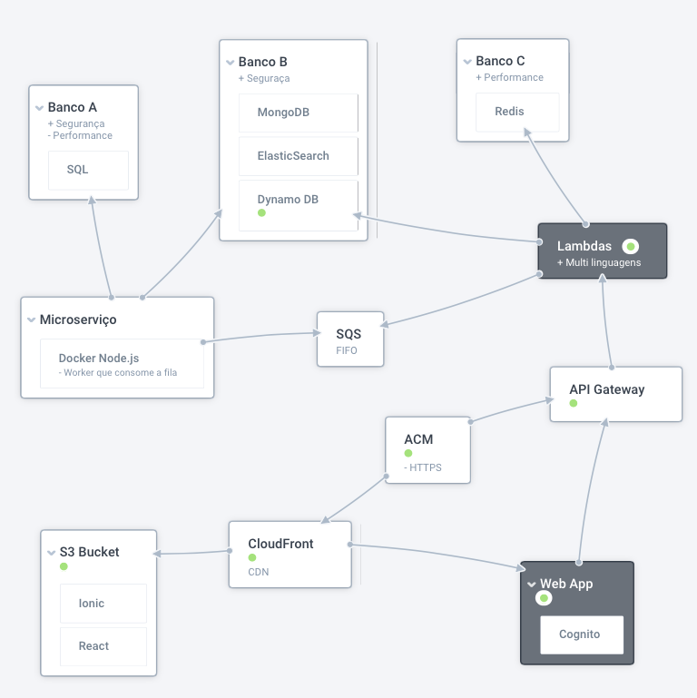
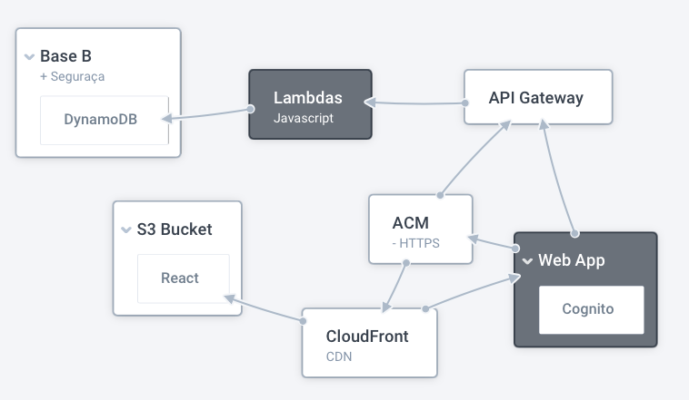
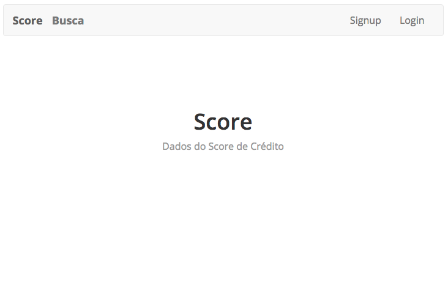
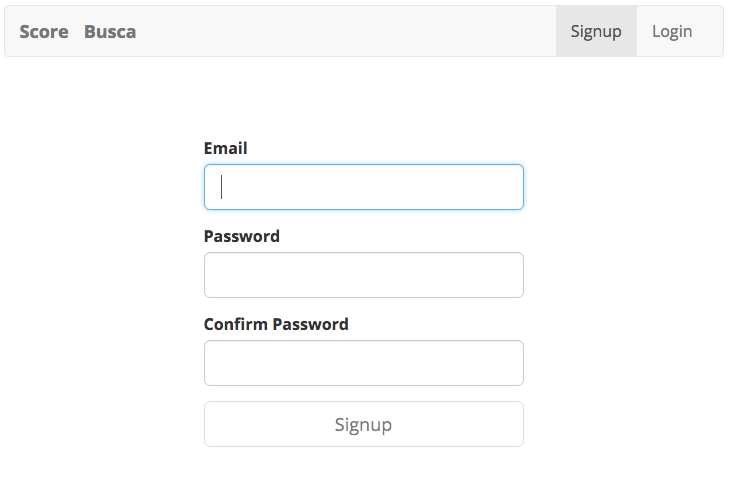
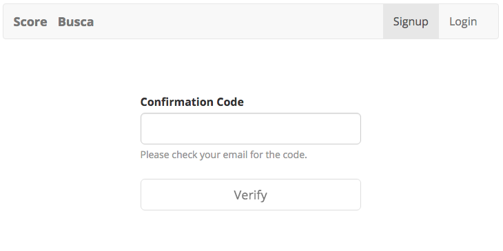
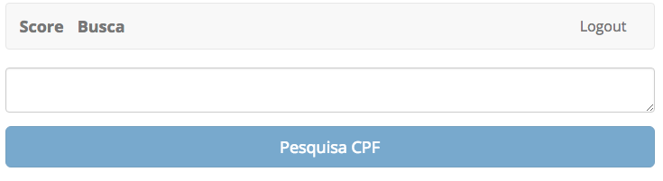
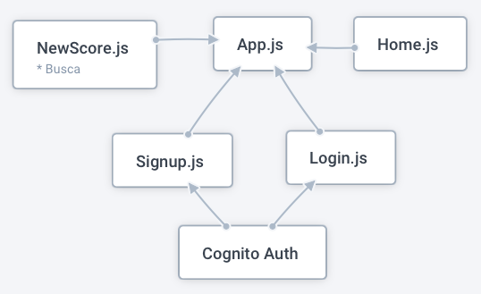

# Desafio
---

## Tecnologias Adotadas
### Web App:
* React.js
* React Router
* Bootstrap
* Stripe
* Seed
* JavaScript
* HTML
* CSS
* Node.js

### Servidor - AWS:
* Lambda
* API Gateway
* DynamoDB
* Cognito
* CloudFront
* ACM (Certificate Manager) 
* Docker

## Arquitetura Utilizada

O problema proposto abre espaço para muitos tipos de solução, levando em conta em que não há um detalhamento na descrição do armazenamento. Não fica claro a diferença, no nível de segurança, entre as Bases A e B, então proponho uma solução de acordo com o conhecimento limitado que é apresentado. 

Na arquitetura da solução, procurei usar as tecnologias que estão dentro do ferramental da empresa, mas também pela alta escalabilidade e disponibilidade, sem falar da segurança e autogerenciamento de várias destas ferramentas. Outra grande vantagem nesta solução "serverless" é o custo bastante baixo, ofertado pela AWS, sendo alguns serviços gratuitos e outros só cobrados quando usados. Na figura abaixo é mostrada a arquitetura usada, junto com algumas alternativas.

### Base A
Para a Base A, imaginei o uso de um banco de dados SQL como MySQL ou PostgreSQL. Os dados seriam armazenados já criptografados. Um container, tipo Docker, conteria o microserviço responsável por controlar o acesso externo, fazendo a descriptografia e gerenciando chaves públicas e privadas. O serviço SQS serviria para controlar a fila de solicitações e evitando a perda de alguma delas, caso haja algum problema com o nanoserviço responsável pela chamada. Cada Base possui seu próprio Lambda, contendo uma função, GET no caso de todos eles, já que o usuário só pode solicitar informações do aplicativo, não podendo fazer edições ou criação de registros no banco de dados. 

### Base B
A Base B possui características similares à Base A, porém exige um desempenho melhor, além de ser também utilizada para extração de dados por meio de Machine Learning. Poderia seguir a mesma fórmula da Base A, usando um banco de dados relacional, porém o microserviço deveria ser menos oneroso, em relação à criptografia. A solução que propus e implementei - ver códigos neste repositório - faz uso do DynamoDB, um banco NoSQL da Amazon. Possui um alto nível de segurança, permitindo criptografar os dados, além da comunicação interna protegida. 

No caso da minha implementação, não fiz uso de um microserviço para gerenciamento do acesso. Os dados são criptografados, e o acesso é feito diretamente pelo seu próprio Lambda.

### Base C
Para a Base C, que exige alta performance, a primeira solução que me vem à mente é o Redis. O Redis é um banco de dados na memória, tipo chave-valor que parece funcionar bem com os tipos de dados da Base C. Ele também pode ser inserido na "frente" de outro banco de dados, criando um cache na memória com excelente desempenho para diminuir a latência de acesso, aumentar o throughput e facilitar a descarga de um banco de dados relacional ou NoSQL. Estes dados seriam requisitados diretamente pelo seu próprio Lambda.

---

Entre o cliente e os Lambdas foi usado o serviço API Gateway, que é um serviço totalmente gerenciado que permite a criação e manutenção de APIs em qualquer escala. Para garantir a segurança na comunicação dos dados, internamente e com o cliente, proponho o ACM (AWS Certificate Manager) que permite implementar facilmente certificados SSL/TLS. Para o gerenciamento dos usuários, compreendendo inscrição (signup), acesso (login) e confirmação de cadastro, usei o serviço Cognito.

O aplicativo feito com o React.js, foi alojado em um bucket S3. Para garantir uma alta disponibilidade do serviço, optei por usar o CloudFront, que é uma rede de entrega de conteúdo (CDN) global aplicativos e APIs aos usuários com segurança, baixa latência e altas velocidades de transferência.

---

### Aplicativo
Os códigos disponíveis neste repositório se referem à solução (prática) de uma parte do problema. Aqui implementei o acesso à Base B, com sua disponibilização no aplicativo web, conforme a imagem abaixo.

A página inicial do aplicativo tem a seguinte aparência:

Possui 4 botões, na barra superior: 

* Score : leva à Home
* Busca : leva à página de pesquisa do Score pelo CPF do usuário
* Signup : para cadastro de novos usuários
* Login : acesso à página de pesquisa pelos usuários autorizados

Para o usuário não cadastrado, ao clicar no botão "Signup", ele se depara com a seguinte tela:

Devido ao uso do Cognito, há uma verificação se o email já não existe no arquivo (ou pool de usuários). Ao fazer o cadastro, o usuário irá receber um código por email (no email cadastrado), que deverá ser usado na tela seguinte:

Ao inserir o código correto e clicar em "Verify", o usuário é levado à página inicial. Desta vez, ao invés de mostrar os botões "Signup" e "Login" no canto superior direito, aparece o botão "Logout".

Estando logado no site, o usuário pode acessar a página de consulte de Score, clicando no botão "Busca". Neste momento a tela que será visualizada será assim:

Ao inserir um CPF válido - e que esteja cadastrado na Base B - as seguintes informações serão disponibilizadas na tela:  

* Idade
* Lista de bens
* Endereço
* Fonte de renda

A arquitetura básica do aplicativo, com seus componentes principais:

---

#### Para rodar aplicativo localmente:
* Clonar o repositório
* Acessar a pasta "score-app-client"
* Rodar o comando "npm install", para instalar os módulos
* Rodar o comando "npm start"
* Acessar a página em um web browser no endereço "localhost:3000"

#### Para testar a API
Tendo já clonado o repositório:

* Acessar a pasta "score-app-api":
* Rodar o comando "npm install", para instalar os módulos
* Para testar o comando GET, rodar no terminal: 
> serverless invoke local --function get --path mocks/get-event.json

## Dados Armazenados
### Base A
* CPF
* Nome
* Endereço
* Lista de dívidas

### Base B
* Idade
* Lista de bens (imóveis, etc.)
* Endereço
* Fonte de renda

Sugestão de dados que podem ser usados pelo time de cientistas de dados, que podem ter algum relação com o comportamento do titular do CPF pesquisado:

* Histórico de dívidas
* Estado civil
* Número de dependentes

### Base C
* Última consulta do CPF em um Bureau de crédito
* Movimentação financeira nesse CPF
* Dados relacionados a última compra com cartão de crédito vinculado ao CPF